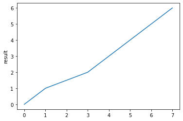

# hello

## 1. What is Jupyter notebook?

Project Jupyter exists to develop open-source software, open-standards, and services for interactive computing across dozens of programming languages.

## 2. Live Code Example


```python
3+4
```


    7


```python
# adding two parameter
def add(a,b):
    return a+b
```


```python
add(5,4)
```


    9


## 3. Equation


```python
#sqrt(x^2+y^2+z^2)
```

This expression $\sqrt{x^2 + Y^2 + z^2}$ is an example of a Tex inline

## 4. Visualization

### 4.1. image


```python
from IPython.display import Image
Image(url="http://song.vmware.ubuntu16:8888/tree?token=555bee7f2b45edb18c6378a274d58880fcf5f747b664956d", width=400, height=100)
```


```python

```

### 4.2. video
### 4.3. table
### 4.4. chart


```python
import matplotlib.pyplot as plt
plt.plot([0,1,1.5,2,3,4,5,6])
plt.ylabel('result')
plt.show()
```





## 5. Performance check


```python
%timeit 3+4
```

    12.8 ns ± 0.199 ns per loop (mean ± std. dev. of 7 runs, 100000000 loops each)


```python
%timeit add(3, 4)
```

    132 ns ± 1.45 ns per loop (mean ± std. dev. of 7 runs, 10000000 loops each)


```python
%%timeit
a=[1,2,3]
a=[x+1 for x in a]
```

    536 ns ± 25.4 ns per loop (mean ± std. dev. of 7 runs, 1000000 loops each)


```python
%%timeit
b=[1,2,3]
for i in range(len(b)):
    b[i] = b[i] + 1
```

    645 ns ± 9.09 ns per loop (mean ± std. dev. of 7 runs, 1000000 loops each)


```python

```
